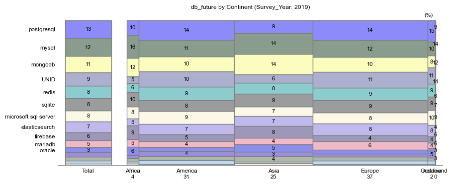

# Stack Overflow Trend Analyses (2019 to 2022)

## Project

This repository is for the first project of the data scientist program of Udacity.  

I retrieved Stack Overflow Survey - Multiple Years results to analyze trends    
over time from 2019 to 2022 with 3 guiding questions:   
* Overall changes of demographic and professional characteristics of participants  
* Programing languages preferred over time  
* Difference in programing language preference by global region and generation  

## Installation

To properly run the jupyter note of Stack_Overflow_Survey_Trend    
you need to install the following modules:  
* **fuzzywuzzy** for data collection  
  **python-Levenshtein** to remove warning in running fuzzywuzzy  
* **country_converter**  for pre-processing  
* **missingno** to overview dataset before analysis

## Files

This repository is composed of  
* one main file - Stack_Overflow_Survey_Trend    
* the module of mozchart to create mosaic charts for the part of trend analyses  
* database folder which can also be downloaded from   
  https://insights.stackoverflow.com/survey  
  ('survey_results_schema_2022.csv' is out of database folder to avoid possible error  
    in downloading files via Github)  

## Points to note

* **execrating common columns** from differently designed data sets  
  I started to understand the shape and the column components of survey results,   
  and all survey results were completely different in their shapes and columns   
  (only 3 columns were commonly used in all survey years).  
  As I was new to the data set, I had to depend on manual checking to some extent    
  to avoid any possible error in extracting columns for analyses.   
  However with the help of fuzzywuzzy module, I could collect over 20 common    
  columns in a efficient way.   

* **2 dimension analysis by mosaic chart**  
  This tool is originally used to check regional market shares and their impact  
  on global business at the sames time.  
  For example, let's assume that we have a product which has 50% of market   
  share in region 1, and 5% in region 2. From this alone it is difficult to conclude   
  whether this product is actually showing a good performance or not.     
  If region 1 is only a tiny market and region 2 is one of the biggest markets,  
  50% market share in region 1 has no significant meaning in global business.   

  To complement this kind of weakness of single point view, we use what is called   
  a mosaic chart - 2 dimension approach where axis y shows market shares and   
  axis x gives information on market size.  
  Here the size of each rectangle intuitively signifies how much market share is  
  gained in how much important market, and the sum of areas of the same color  
  shows how brands are performing region by region and in global market total.

  I applied this tool to see how programing languages are gaining or loosing   
  shares region by region (find example below)

 

* this project used descriptive statistics, that **missing values** were simply   
  regarded as UNID (unidentified) in creating a series of distribution charts. 

## Summary of findings

### Overall changes of demographic and professional characteristics of survey participants  
- The portions of survey participants in Europe, Asia and Africa are    
slightly increasing while that of America is decreasing   
- In gender there is no significant change with man about 90% and woman about 5%.   
- In the question of whether coding is a main profession, the answer of yes stays at 75%.     
The portion of amateur programmers (Learning to Code and Coding as Hobby) is also     
at the same 15% to 16% level.
- For age, education level, employment status, the size of organizations    
where participants are working, there are huge uncertainty from changing high portion     
of no answers (marked as UNID - unidentified), that I made no conclusion

### Programing languages preferred over time
- In database languages, the portions of 'redis', 'postgresql' and 'mongodb'    
  are increasing, while 'mysql' and 'microsoft sql server' are decreasing.    
  This trend is continuing in future preference.  
- In programing languages, the portions of 'typescript', 'python' and    
  'bash/shell/powershell' are increasing, while 'sql', 'ocaml', 'C++' and 'C#'    
  are decreasing. In future preference, 'typescript' is further increasing.

### Programing language preference by global region and generation

About future preference on DB languages, 
* ’postgresqu' is gaining preference more in America and Europe.   
* The popularity of 'redis' and 'sqlite' are more evenly distributed in 3 main regions.     
* 'mysql' is losing its share in all regions.

In terms of age,    
* 3%p increase of 'postgresqu' is mainly driven by age 25 to 44.    
* The future of 'redis' seems to be even better with drastic increase in Age under 18,     
* 'sqlite' preference is moving to older generation.    
* 'mongodb' stays at 11% preference, but younger generation's support on this language is also notable.  

About future preference on programing languages, 
* 'typerscript' is gaining popularity in all regions.    
* ‘javascript' and 'html/css' are losing shares in most regions. 

In terms of age,    
* 'typerscript' shows 2%p increase mainly driven by age under 25.   
* 'javascript' and 'html/css' are losing shares in all ages.  
* 'sql' is becoming the language of older people with its share staying at 8%.

## License

This repository is with MIT License.